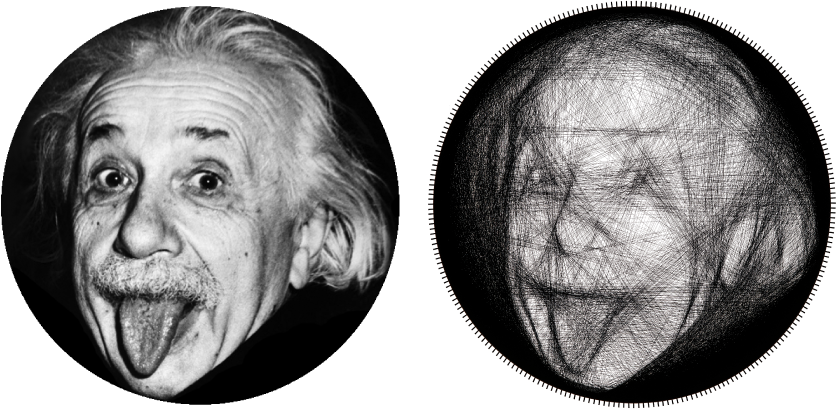

# String Art: Towards Computational Fabrication of String Images

Official repository for the Eurographics 2018 paper

[Project Page](https://www.cg.tuwien.ac.at/research/publications/2018/Birsak2018-SA/)
[Video](https://www.cg.tuwien.ac.at/research/publications/2018/Birsak2018-SA/Birsak2018-SA-video.mp4)

# Example Input and Output

## Usage
Simply start one of the example files, e.g. example_einstein.m

## Citation
Please cite this work if you use any parts of this code repository for your own research:

    @article{Birsak2018-SA,
      title =      "String Art: Towards Computational Fabrication of String
                   Images",
      author =     "Michael Birsak and Florian Rist and Peter Wonka and
                   Przemyslaw Musialski",
      year =       "2018",
      abstract =   "In this paper we propose a novel method for the automatic
                   computation and digital fabrication of artistic string
                   images. String art is a technique used by artists for the
                   creation of abstracted images which are composed of straight
                   lines of strings ten- sioned between pins distributed on a
                   frame. Together the strings fuse to a perceptible image.
                   Traditionally, artists craft such images manually in a
                   highly sophisticated and tedious design process. To achieve
                   this goal fully automatically we propose a computational
                   setup driven by a discrete optimization algorithm which
                   takes an ordinary picture as input and converts it into a
                   connected graph of strings that tries to reassemble the
                   input image best possibly. Furthermore, we propose a
                   hardware setup for automatic digital fabrication of these
                   images using an industrial robot that spans the strings.
                   Finally, we demonstrate the applicability of our approach by
                   generating and fabricating a set of real string art images.",
      month =      apr,
      journal =    "Computer Graphics Forum (Proc. EUROGRAPHICS 2018)",
      volume =     "37",
      number =     "2",
      doi =        "10.1111/cgf.13359",
      pages =      "accepted",
      pages =      "263--274",
      URL =        "https://www.cg.tuwien.ac.at/research/publications/2018/Birsak2018-SA/",
    }
